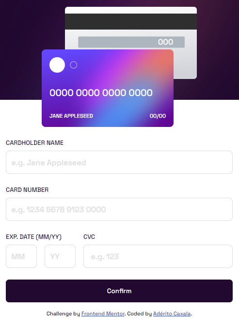

# Frontend Mentor - Interactive card details form solution

This is a solution to the [Interactive card details form challenge on Frontend Mentor](https://www.frontendmentor.io/challenges/interactive-card-details-form-XpS8cKZDWw). Frontend Mentor challenges help you improve your coding skills by building realistic projects. 

## Table of contents

  - [The challenge](#the-challenge)
  - [Screenshot](#screenshot)
  - [Links](#links)
  - [Built with](#built-with)
  - [Continued development](#continued-development)
- [Author](#author)

**Note: Delete this note and update the table of contents based on what sections you keep.**

### The challenge

Users should be able to:

- Fill in the form and see the card details update in real-time
- Receive error messages when the form is submitted if:
  - Any input field is empty
  - The card number, expiry date, or CVC fields are in the wrong format
- View the optimal layout depending on their device's screen size
- See hover, active, and focus states for interactive elements on the page

### Screenshot

### Links

- Solution URL: [here](https://github.com/Heliandro1/interactive-card-details-form-main)
- Live Site URL: [here](https://interactive-card-details-mu.vercel.app/)

### Built with

- Semantic HTML5 markup
- CSS custom properties
- Flexbox
- Mobile-first workflow

### Continued development

I will keep focusing on front-end web projects with responsive layouts and the most valuables features and the best pratices 

## Author

- Frontend Mentor - [@heliandro1](https://www.frontendmentor.io/profile/heliandro1)
- Linkedin - [@adérito-caxala](https://www.linkedin.com/in/adérito-caxala)
- Instagram - [@heliandro_10](https://www.instagram.com/heliandro_10)
- Facebook - [@Heliandro](https://www.facebook.com/heliandro.1)

